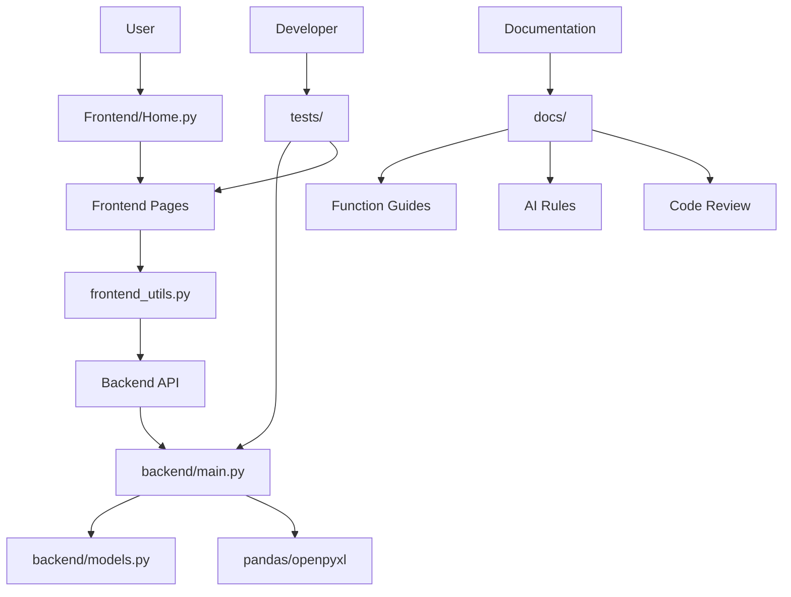

# 📁 Project Structure Guide

## 🎯 Purpose

This document explains the organization and relationships between files in Chen's Engineer Toolbox.

---

## 📂 Directory Tree

```
Tool_Box_Chen/
├── backend/                      # Backend API (FastAPI)
│   ├── __init__.py               # Package init
│   ├── main.py                   # FastAPI app, endpoints, business logic
│   └── models.py                 # Pydantic models for validation
│
├── frontend/                     # Frontend UI (Streamlit)
│   ├── __init__.py               # Package init
│   ├── Home.py                   # Main entry point (cover page)
│   ├── frontend_utils.py         # Shared utilities, API wrappers
│   └── pages/                    # Streamlit pages (auto-discovered)
│       ├── 1_Dashboard.py        # Dashboard overview
│       ├── 2_Facility.py         # Facility tools (placeholder)
│       ├── 3_Pipeline.py         # Pipeline tools page
│       └── 4_ILI_Visual_Tool.py  # ILI data analysis tool
│
├── tests/                        # Test suite
│   ├── __init__.py               # Test package init
│   ├── test_backend.py           # Backend API tests
│   └── fixtures/                 # Test data files (create as needed)
│
├── docs/                         # Documentation
│   ├── README.md                 # Documentation hub
│   ├── ARCHITECTURE.md           # System architecture
│   ├── DEVELOPMENT_GUIDE.md      # Development practices
│   ├── AI_DEVELOPMENT_RULES.md   # ⚠️ CRITICAL: AI constraints
│   ├── CODE_REVIEW_CHECKLIST.md  # Review standards
│   ├── PROJECT_STRUCTURE.md      # This file
│   └── functions/                # Function-specific guides
│       ├── ILI_VISUAL_TOOL.md    # ILI tool guide
│       ├── DASHBOARD.md          # Dashboard guide
│       ├── FACILITY.md           # Facility tools guide
│       ├── BACKEND_API.md        # Backend API guide
│       └── FRONTEND_COMPONENTS.md # Frontend patterns
│
├── .gitignore                    # Git ignore rules
├── .pre-commit-config.yaml       # Pre-commit hooks config
├── pyproject.toml                # Project config (uv)
├── requirements.txt              # Dependencies (pip)
├── requirements-dev.txt          # Dev dependencies
├── README.md                     # Main project README
├── QUICK_START.md                # Quick setup guide
├── run_backend.sh                # Backend run script (Unix)
├── run_backend.bat               # Backend run script (Windows)
├── run_frontend.sh               # Frontend run script (Unix)
└── run_frontend.bat              # Frontend run script (Windows)
```

---

## 🔗 File Relationships

### Backend Dependencies

```
backend/main.py
    ├── imports: backend/models.py
    ├── imports: fastapi, pandas, numpy, openpyxl
    └── exposes: REST API endpoints

backend/models.py
    ├── imports: pydantic
    └── exposes: Request/Response models
```

### Frontend Dependencies

```
frontend/Home.py
    ├── imports: streamlit
    └── entry point for Streamlit app

frontend/pages/*.py
    ├── imports: streamlit
    ├── imports: frontend/frontend_utils.py
    ├── imports: plotly (for visualizations)
    └── auto-discovered by Streamlit

frontend/frontend_utils.py
    ├── imports: httpx
    └── exposes: API call wrappers, utilities
```

### Test Dependencies

```
tests/test_backend.py
    ├── imports: backend/main.py
    ├── imports: fastapi.testclient
    └── uses: fixtures/ (test data)
```

---

## 📄 File Purposes

### Root Level Files

| File | Purpose | Modify Frequency |
|------|---------|------------------|
| `README.md` | Main documentation for users | Medium |
| `QUICK_START.md` | Quick setup instructions | Low |
| `pyproject.toml` | Project configuration (uv) | Low |
| `requirements.txt` | Dependencies for pip | Medium |
| `requirements-dev.txt` | Dev dependencies | Low |
| `.gitignore` | Git ignore patterns | Low |
| `.pre-commit-config.yaml` | Pre-commit hook config | Low |

### Backend Files

| File | Purpose | Modify Frequency |
|------|---------|------------------|
| `backend/main.py` | API endpoints, business logic | High |
| `backend/models.py` | Data validation models | Medium |

### Frontend Files

| File | Purpose | Modify Frequency |
|------|---------|------------------|
| `frontend/Home.py` | Cover page | Low |
| `frontend/frontend_utils.py` | Shared utilities | Medium |
| `frontend/pages/1_Dashboard.py` | Dashboard page | Medium |
| `frontend/pages/2_Facility.py` | Facility tools | High (in dev) |
| `frontend/pages/3_Pipeline.py` | Pipeline tools | Low |
| `frontend/pages/4_ILI_Visual_Tool.py` | ILI analysis | Medium |

### Documentation Files

| File | Purpose | Update When |
|------|---------|-------------|
| `docs/README.md` | Documentation hub | Adding new docs |
| `docs/ARCHITECTURE.md` | System design | Architecture changes |
| `docs/DEVELOPMENT_GUIDE.md` | Dev practices | New practices added |
| `docs/AI_DEVELOPMENT_RULES.md` | AI constraints | New rules needed |
| `docs/CODE_REVIEW_CHECKLIST.md` | Review standards | Process changes |
| `docs/PROJECT_STRUCTURE.md` | This file | Structure changes |
| `docs/functions/*.md` | Function guides | Function changes |

---

## 🎯 Where to Add New Code

### New Backend Endpoint

1. **Define models**: `backend/models.py`
   ```python
   class NewRequest(BaseModel):
       param: str
   
   class NewResponse(BaseModel):
       result: dict
   ```

2. **Implement endpoint**: `backend/main.py`
   ```python
   @app.post("/api/new-endpoint", response_model=NewResponse)
   async def new_endpoint(request: NewRequest):
       pass
   ```

3. **Add tests**: `tests/test_backend.py`
   ```python
   def test_new_endpoint():
       pass
   ```

4. **Document**: `docs/functions/BACKEND_API.md`

### New Frontend Page

1. **Create page**: `frontend/pages/N_PageName.py`
   ```python
   import streamlit as st
   
   st.title("Page Title")
   ```

2. **Add API calls**: `frontend/frontend_utils.py` (if needed)
   ```python
   def call_new_api():
       pass
   ```

3. **Document**: `docs/functions/PAGENAME.md`

### New Utility Function

**Backend**: Add to `backend/main.py` or create new module in `backend/`

**Frontend**: Add to `frontend/frontend_utils.py` or create new module in `frontend/`

### New Test

**Backend**: Add to `tests/test_backend.py`

**Frontend**: Create `tests/test_frontend.py` (currently manual)

**Test Data**: Add to `tests/fixtures/`

### New Documentation

**Architecture**: Update `docs/ARCHITECTURE.md`

**New function**: Create `docs/functions/FUNCTION_NAME.md`

**Development practice**: Update `docs/DEVELOPMENT_GUIDE.md`

**AI rules**: Update `docs/AI_DEVELOPMENT_RULES.md`

**Code review**: Update `docs/CODE_REVIEW_CHECKLIST.md`

---

## 🚫 What NOT to Create

### Avoid Creating

- ❌ Duplicate utility functions (check existing first)
- ❌ Temporary test files in root directory
- ❌ Configuration files not tracked by git
- ❌ Database files in repository
- ❌ Large binary files (use .gitignore)
- ❌ Personal environment files (.env with secrets)
- ❌ Compiled Python files (__pycache__, *.pyc)

### Use .gitignore For

- Virtual environments (`venv/`, `.venv/`)
- Environment files (`.env`)
- IDE configs (`.vscode/`, `.idea/`)
- Test artifacts (`htmlcov/`, `.coverage`)
- Compiled Python (`__pycache__/`, `*.pyc`)
- OS files (`.DS_Store`, `Thumbs.db`)

---

## 📊 Module Relationships



---

## 🔄 Data Flow Through Files

### Example: ILI File Processing

```
1. User uploads file
   └─> frontend/pages/4_ILI_Visual_Tool.py

2. File sent to backend
   └─> frontend/frontend_utils.py::process_ili_data()
       └─> httpx.post("/api/ili/process", ...)

3. Backend receives request
   └─> backend/main.py::process_ili_data()
       ├─> Validates with backend/models.py
       ├─> Processes with pandas/openpyxl
       └─> Returns backend/models.py::ProcessResponse

4. Frontend displays results
   └─> frontend/pages/4_ILI_Visual_Tool.py
       └─> plotly visualizations
```

---

## 📝 File Naming Conventions

### Python Files

- **Modules**: `lowercase_with_underscores.py`
- **Classes**: `PascalCase` inside files
- **Functions**: `lowercase_with_underscores()`
- **Constants**: `UPPERCASE_WITH_UNDERSCORES`

### Documentation Files

- **Main docs**: `UPPERCASE.md` (e.g., `README.md`, `ARCHITECTURE.md`)
- **Function guides**: `FUNCTION_NAME.md` (e.g., `ILI_VISUAL_TOOL.md`)

### Test Files

- **Pattern**: `test_*.py` (e.g., `test_backend.py`)
- **Fixtures**: `sample_*.xlsx`, `test_*.json`

### Scripts

- **Unix**: `*.sh` (e.g., `run_backend.sh`)
- **Windows**: `*.bat` (e.g., `run_backend.bat`)

---

## 🎯 Quick Reference

### "Where do I find..."

| What | Location |
|------|----------|
| API endpoints | `backend/main.py` |
| Data models | `backend/models.py` |
| Frontend pages | `frontend/pages/*.py` |
| API wrappers | `frontend/frontend_utils.py` |
| Tests | `tests/test_backend.py` |
| Architecture docs | `docs/ARCHITECTURE.md` |
| Function guides | `docs/functions/*.md` |
| Dependencies | `requirements.txt` or `pyproject.toml` |

### "Where do I add..."

| What | Location |
|------|----------|
| New endpoint | `backend/main.py` + `backend/models.py` |
| New page | `frontend/pages/N_PageName.py` |
| New API call | `frontend/frontend_utils.py` |
| New test | `tests/test_backend.py` |
| New utility | `frontend/frontend_utils.py` or `backend/main.py` |
| New documentation | `docs/functions/FUNCTION.md` |

---

## 🔍 Finding Code

### By Functionality

| Functionality | Primary File |
|--------------|--------------|
| Health check | `backend/main.py::health_check()` |
| File preview | `backend/main.py::preview_excel()` |
| ILI processing | `backend/main.py::process_ili_data()` |
| ILI UI | `frontend/pages/4_ILI_Visual_Tool.py` |
| Dashboard | `frontend/pages/1_Dashboard.py` |
| File validation | `backend/main.py::validate_file_size()` |
| Statistics | `backend/main.py::calculate_stats()` |

### By Feature

| Feature | Backend | Frontend | Tests |
|---------|---------|----------|-------|
| ILI Tool | `main.py` lines 96-217 | `4_ILI_Visual_Tool.py` | `test_backend.py` |
| Dashboard | N/A | `1_Dashboard.py` | Manual |
| Facility | N/A (planned) | `2_Facility.py` | Not yet |

---

**Last Updated**: October 2025  
**Project Version**: 0.1.0
