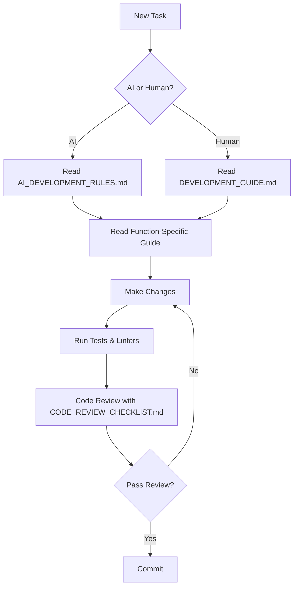

# 📚 Documentation Hub

Welcome to the comprehensive documentation for **Chen's Engineer Toolbox**.

## 📖 Documentation Structure

### 🏗️ Architecture & Design
- [**ARCHITECTURE.md**](ARCHITECTURE.md) - System architecture, tech stack, and design decisions
- [**PROJECT_STRUCTURE.md**](PROJECT_STRUCTURE.md) - File organization and module relationships

### 🛠️ Development Guides
- [**DEVELOPMENT_GUIDE.md**](DEVELOPMENT_GUIDE.md) - General development practices and setup
- [**AI_DEVELOPMENT_RULES.md**](AI_DEVELOPMENT_RULES.md) - **CRITICAL**: Rules for AI-assisted development to prevent over-modification
- [**CODE_REVIEW_CHECKLIST.md**](CODE_REVIEW_CHECKLIST.md) - Senior-level code review standards

### 🧩 Function-Specific Development
- [**functions/ILI_VISUAL_TOOL.md**](functions/ILI_VISUAL_TOOL.md) - ILI Visual Tool development guide
- [**functions/DASHBOARD.md**](functions/DASHBOARD.md) - Dashboard functionality guide
- [**functions/FACILITY.md**](functions/FACILITY.md) - Facility tools development guide
- [**functions/BACKEND_API.md**](functions/BACKEND_API.md) - Backend API development guide
- [**functions/FRONTEND_COMPONENTS.md**](functions/FRONTEND_COMPONENTS.md) - Frontend components guide

### 🚀 User Guides
- [**../README.md**](../README.md) - Main project README (installation, features, quick start)
- [**../QUICK_START.md**](../QUICK_START.md) - 3-step quick start guide
- [**DOCUMENTATION_SETUP_COMPLETE.md**](DOCUMENTATION_SETUP_COMPLETE.md) - Project overview and documentation summary

## 🎯 Quick Navigation

### For Developers
1. **Starting a new feature?** → Read [DEVELOPMENT_GUIDE.md](DEVELOPMENT_GUIDE.md) and [AI_DEVELOPMENT_RULES.md](AI_DEVELOPMENT_RULES.md)
2. **Working on specific function?** → Check [functions/](functions/) for function-specific guides
3. **Code review?** → Use [CODE_REVIEW_CHECKLIST.md](CODE_REVIEW_CHECKLIST.md)
4. **Understanding the system?** → Read [ARCHITECTURE.md](ARCHITECTURE.md)

### For AI Assistants
⚠️ **MUST READ BEFORE ANY CODE CHANGES:**
- [**AI_DEVELOPMENT_RULES.md**](AI_DEVELOPMENT_RULES.md) - Critical constraints and guidelines
- Review the specific function guide in [functions/](functions/) before modifying any code

### For Users
1. **Getting started?** → [../QUICK_START.md](../QUICK_START.md)
2. **Full documentation?** → [../README.md](../README.md)
3. **Project overview?** → [DOCUMENTATION_SETUP_COMPLETE.md](DOCUMENTATION_SETUP_COMPLETE.md)

## 📋 Development Workflow

## 🔄 Document Maintenance

### When to Update Documentation
- **Adding a new feature/function** → Create new guide in `functions/`
- **Changing architecture** → Update `ARCHITECTURE.md`
- **New development practices** → Update `DEVELOPMENT_GUIDE.md`
- **New AI constraints** → Update `AI_DEVELOPMENT_RULES.md`
- **User-facing changes** → Update main `README.md`

### Documentation Standards
- Use clear, concise language
- Include code examples where helpful
- Keep AI development rules explicit and measurable
- Update function guides when changing function behavior
- Add warnings for breaking changes

## 🆘 Getting Help

1. **Technical issues**: Check function-specific guide
2. **Development questions**: See `DEVELOPMENT_GUIDE.md`
3. **Architecture questions**: See `ARCHITECTURE.md`
4. **Code quality concerns**: Review `CODE_REVIEW_CHECKLIST.md`

---

**Last Updated**: October 2025  
**Project Version**: 0.1.0
